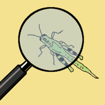

    

        <!--img src="http://lorempixel.com/200/200/animals" alt="logo" /-->
        
        

<h1 class="text-center">Entomologia Politica</h1>
            

Che cosa e' il Movimento 5 Stelle? Chi sono Grillo e Casaleggio? Che gente sono i "pentastellati"? Cosa combinano in parlamento? Se volete scoprire questo ed altro insieme a noi, al riparo del rumore di fondo degli insulti, degli slogan, dei pregiudizi...

Benvenuti!

            

        

    

    

        

            <h2>Temi principali</h2>
            <ul>
                <li><a href="#">Beppe Grillo (TODO)</a></li>
                <li><a href="storia.html">Storia del Movimento 5 Stelle (TODO)</a></li>
                <li><a href="totalitarismo.html">Timori di totalitarirsmo (TODO)</a></li>
                <li><a href="good.html">Good News (TODO)</a></li>
                <li><a href="biblio.html">Bibliografia (TODO)</a></li>
            </ul>
            <!--p><a class="btn btn-default" href="#" role="button">View details &raquo;</a></p-->
        

        

            <h2>Le persone del M5S</h2>
            <ul>
                <li><a href="#">Casaleggio (TODO)</a></li>
                <li><a href="#">Parlamentari (TODO)</a></li>
                <li><a href="#">Collaboratori parlamentari (TODO)</a></li>
                <li><a href="#">Epurati (TODO)</a></li>
                <li><a href="#">Attivisti (TODO)</a></li>
            </ul>
        

        

            <h2>Attività politica del M5S</h2>
            <ul>
                <li><a href="#">Osservatorio parlamentare (TODO)</a></li>
                <li><a href="#">Amministrazioni locali (TODO)</a></li>
            </ul>
        

    

